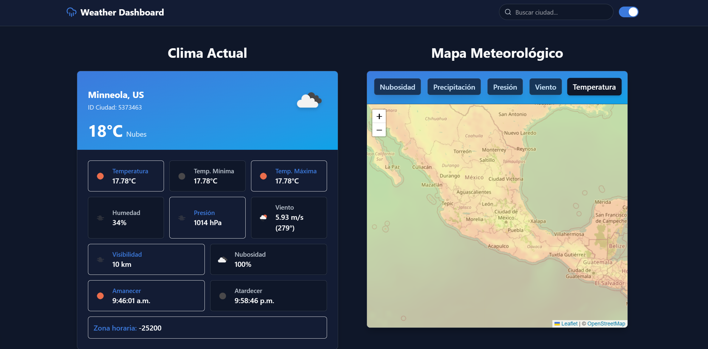
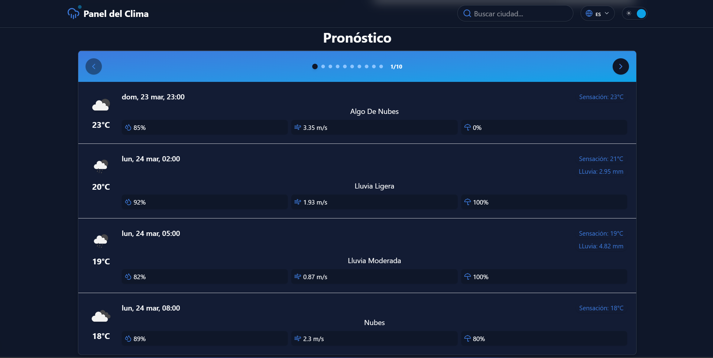

# 🌦️ Weather Dashboard

## 📌 Descripción
Weather Dashboard es una aplicación web en tiempo real que muestra información meteorológica precisa utilizando la API de [OpenWeatherMap](https://openweathermap.org). La aplicación obtiene datos basados en la geolocalización del usuario y presenta:

- Temperatura actual y sensación térmica
- Humedad, presión atmosférica y velocidad del viento
- Condiciones climáticas detalladas con iconos dinámicos
- Pronóstico por horas y días (hasta 7 días)
- Mapas meteorológicos interactivos con Leaflet

## 🚀 Capturas de pantalla


 

## 🛠️ Tecnologías Utilizadas

- **Next.js** (App Router)
- **TypeScript**
- **Tailwind CSS** (V0 de Vercel)
- **OpenWeatherMap API** (para datos meteorológicos)
- **Leaflet.js** (para mapas interactivos)

## 🏗️ Instalación y Configuración

### 1️⃣ Clonar el Repositorio
```bash
 git clone https://github.com/MikeDevQH/Weather-dashboard.git
 cd Weather-dashboard
```

### 2️⃣ Instalar Dependencias
```bash
 npm install
```

### 3️⃣ Configurar la API Key de OpenWeatherMap
Para obtener datos climáticos, necesitas una API Key de OpenWeatherMap. 

1. Regístrate en [OpenWeatherMap](https://openweathermap.org)
2. Dirígete a "API Keys" y genera una nueva clave
3. Crea un archivo `.env.local` en la raíz del proyecto y agrega:

```env
NEXT_PUBLIC_OPENWEATHER_API_KEY=TU_API_KEY
```

### 4️⃣ Ejecutar en Desarrollo
```bash
 npm run dev
```
Abre en tu navegador [http://localhost:3000](http://localhost:3000).

## 🌍 Despliegue en Vercel

Puedes desplegar el proyecto fácilmente en Vercel:
```bash
 vercel
```

O manualmente a través del panel de control de [Vercel](https://vercel.com).

## 🌟 Planes Futuros

🔹 **Mejoras en el diseño**: Agregar animaciones, transiciones y mejoras en la paleta de colores.  
🔹 **Selección de ciudades**: Permitir a los usuarios buscar y ver el clima de cualquier ciudad.  
🔹 **Soporte multi-idioma**: Agregar traducciones para una experiencia más accesible.  
🔹 **Mejor integración de mapas**: Implementar más capas de información meteorológica en los mapas.

## 🤝 Contribuciones
Las contribuciones son bienvenidas. Si encuentras un problema o tienes una idea para mejorar el proyecto:
1. Haz un fork del repositorio
2. Crea una nueva rama (`git checkout -b feature-nueva`)
3. Realiza tus cambios y haz commit (`git commit -m "Descripción"`)
4. Haz push a la rama (`git push origin feature-nueva`)
5. Abre un Pull Request

## 📄 Licencia
Este proyecto está bajo la Licencia MIT. ¡Disfrútalo y siéntete libre de mejorarlo! 🎉

## 💖 Creado por
Desarrollado con mucho ❤️ por [MikeDevQH](https://github.com/MikeDevQH). ¡Espero que te sea útil! 😊
